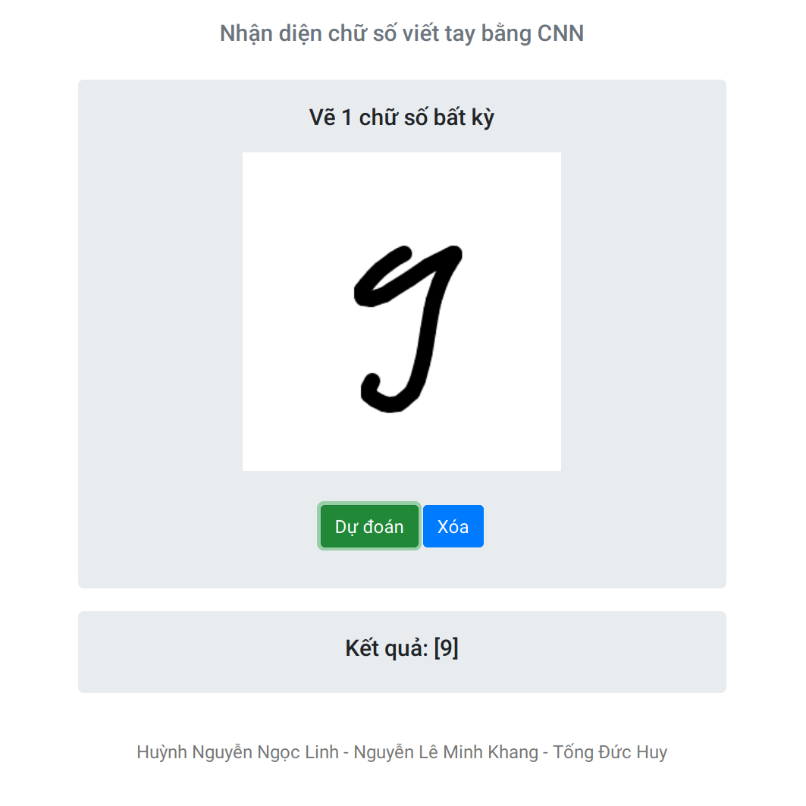

# digit-classifier
> A digit classifier using Convolutional Neural Network

    

## Dataset

The complete CVL Single Digit dataset consists of 10 classes (0-9) with 3,578 samples per class. For the HDR competition, 7,000 digits (700 digits per class) of 67 writers have been selected as training set. The validation set is of equal size with a different set of 60 writers. The validation set may be used for parameter estimation and validation but not for supervised training. The evaluation set consists of 2,178 digits per class resulting in 21,780 evaluation samples of the remaining 176 writers.

## Requirements

* `python3`
* `pip`

## Test model

1. `pip install -r requirements.txt`
1. `python3 gui.py`
1. Access the localhost on your browser
